# CardForge Deep Research Report

## Scope and key design constraints

You’re essentially building two tightly-related products: a Python **library** that turns YAML configuration into a printable **PDF deck** using **LaTeX templates**, and a **local web application** that helps users visually author and manage those YAML files.

Several constraints drive the architecture:

The web app will be most useful if it can generate **valid configuration** automatically and keep it valid as the schema evolves. That pushes toward strongly-typed Python models with explicit validation and schema export. Pydantic is explicitly designed for “data validation using Python type hints,” which aligns with that need.

Because the output is PDF via LaTeX, you’ll want a reproducible, automated compilation step. Both **latexmk** (automation wrapper around repeated LaTeX/BibTeX runs) and **Tectonic** (a modern TeX engine that downloads needed support files for you) are relevant choices for a robust “one command builds the deck” workflow.

Finally, “layouts are templates” while “cards provide values,” which implies a clean separation between **layout templates** (structure, geometry, style) and **card instances/values** (text, image paths, per-card overrides).

## Data models and UML class diagram

The models below are designed to support:

- Nested layouts (containers containing other layouts).
- Two sides per card (front/back).
- Relative and absolute positioning/sizing.
- Sub-decks that override global sizing/print parameters.
- Card values mapped by layout element `id` (per side).

The diagram is written in PlantUML so you can render it as a UML class diagram.

```plantuml
@startuml
skinparam classAttributeIconSize 0

' ---------- Core geometry ----------
enum ReferenceFrame {
  CARD
  PARENT
}
enum MeasureMode {
  ABSOLUTE
  RELATIVE
}
enum CardSide {
  FRONT
  BACK
}

class MeasureSpec {
  +mode: MeasureMode
  +value: float
  +unit: str        ' e.g., "mm", "pt" (only when ABSOLUTE)
  +ref: ReferenceFrame  ' only when RELATIVE
}

class RectSpec {
  +x: MeasureSpec
  +y: MeasureSpec
  +width: MeasureSpec
  +height: MeasureSpec
  +anchor: str      ' e.g., "top_left", "center"
}

' ---------- Layout templates ----------
abstract class LayoutNode {
  +id: str
  +side: CardSide
  +rect: RectSpec
  +z_index: int
  +opacity: float
  +rotation_deg: float
}

class ImageLayout {
  +fit: str         ' cover|contain|stretch
  +crop_anchor: str ' center|top|bottom|left|right
  +clip: bool
}
class TextLayout {
  +font_family: str
  +font_size_pt: float
  +font_color: str
  +align: str       ' left|center|right|justify
  +wrap: bool
  +line_height: float
}
class ColorLayout {
  +color: str
}
class ContainerLayout {
  +children: List<LayoutNode>
  +padding_left: MeasureSpec
  +padding_top: MeasureSpec
  +padding_right: MeasureSpec
  +padding_bottom: MeasureSpec
}
class BleedLayout {
  +bleed_mm: float?       ' if null => use deck globals
  +stroke_color: str
  +stroke_width_pt: float
}

LayoutNode <|-- ImageLayout
LayoutNode <|-- TextLayout
LayoutNode <|-- ColorLayout
LayoutNode <|-- ContainerLayout
LayoutNode <|-- BleedLayout

class CardLayoutTemplate {
  +id: str
  +name: str
  +front_root: ContainerLayout
  +back_root: ContainerLayout
}

' ---------- Card values (content) ----------
abstract class CardValue {
  +type: str
}
class TextValue {
  +text: str
}
class ImageValue {
  +path: str
}
class ColorValue {
  +color: str
}

CardValue <|-- TextValue
CardValue <|-- ImageValue
CardValue <|-- ColorValue

class CardSpec {
  +id: str
  +name: str
  +layout_id: str
  +values_front: Map<str, CardValue>  ' key = layout node id
  +values_back: Map<str, CardValue>
}

CardSpec --> CardLayoutTemplate : uses >

' ---------- Deck ----------
class CardEntry {
  +card_id: str
  +copies: int
}

class DeckGlobals {
  +card_width_mm: float
  +card_height_mm: float
  +bleed_mm: float
  +dpi: int
  +assets_root: str
}

class SubDeckSpec {
  +id: str
  +name: str
  +overrides: DeckGlobals?   ' partial overrides applied over deck globals
  +cards: List<CardEntry>
}

class DeckSpec {
  +id: str
  +name: str
  +globals: DeckGlobals
  +subdecks: List<SubDeckSpec>
  +output_pdf: str
  +pdf_per_subdeck: bool
}

DeckSpec "1" o-- "0..*" SubDeckSpec
SubDeckSpec "1" o-- "1..*" CardEntry
@enduml
```



Design notes that will matter in implementation:

Relative measures should be resolved against either the **card rectangle** or the **parent layout rectangle** (your requirement), which is why `ReferenceFrame` exists.

Side support is handled by having two separate roots (`front_root` / `back_root`) plus `values_front` / `values_back`. This stays simple for users and for the UI (two tabs, two trees).

Even though “layouts are templates,” styles like font family/size/color (for `TextLayout`) and fit/crop rules (for `ImageLayout`) live naturally in the template layer, while the dynamic values (the actual strings and asset paths) live in `CardValue`.

## YAML example configuration file for a deck with three cards

This single YAML file is intentionally self-contained for clarity (layouts + cards + deck). In practice, you’ll likely split it into multiple YAML files (layouts/cards/decks) and have a manifest that composes them, but this satisfies your “one example config” task.

```yaml
schema_version: 1

layouts:
  - id: spell_small_v1
    name: "Spell (small) - title top"
    front_root:
      type: container
      id: root
      side: FRONT
      rect:
        x: { mode: RELATIVE, value: 0.0, ref: CARD }
        y: { mode: RELATIVE, value: 0.0, ref: CARD }
        width:  { mode: RELATIVE, value: 1.0, ref: CARD }
        height: { mode: RELATIVE, value: 1.0, ref: CARD }
        anchor: top_left
      padding_left:  { mode: ABSOLUTE, value: 0, unit: mm, ref: CARD }
      padding_top:   { mode: ABSOLUTE, value: 0, unit: mm, ref: CARD }
      padding_right: { mode: ABSOLUTE, value: 0, unit: mm, ref: CARD }
      padding_bottom:{ mode: ABSOLUTE, value: 0, unit: mm, ref: CARD }
      children:
        - type: image
          id: bg
          side: FRONT
          rect:
            x: { mode: RELATIVE, value: 0.0, ref: CARD }
            y: { mode: RELATIVE, value: 0.0, ref: CARD }
            width:  { mode: RELATIVE, value: 1.0, ref: CARD }
            height: { mode: RELATIVE, value: 1.0, ref: CARD }
            anchor: top_left
          fit: cover
          crop_anchor: center
          clip: true

        - type: container
          id: header
          side: FRONT
          rect:
            x: { mode: RELATIVE, value: 0.06, ref: CARD }
            y: { mode: RELATIVE, value: 0.05, ref: CARD }
            width:  { mode: RELATIVE, value: 0.88, ref: CARD }
            height: { mode: RELATIVE, value: 0.12, ref: CARD }
            anchor: top_left
          padding_left:  { mode: ABSOLUTE, value: 0, unit: mm, ref: CARD }
          padding_top:   { mode: ABSOLUTE, value: 0, unit: mm, ref: CARD }
          padding_right: { mode: ABSOLUTE, value: 0, unit: mm, ref: CARD }
          padding_bottom:{ mode: ABSOLUTE, value: 0, unit: mm, ref: CARD }
          children:
            - type: text
              id: title
              side: FRONT
              rect:
                x: { mode: RELATIVE, value: 0.0, ref: PARENT }
                y: { mode: RELATIVE, value: 0.0, ref: PARENT }
                width:  { mode: RELATIVE, value: 1.0, ref: PARENT }
                height: { mode: RELATIVE, value: 1.0, ref: PARENT }
                anchor: top_left
              font_family: "TeX Gyre Heros"
              font_size_pt: 18
              font_color: "#ffffff"
              align: center
              wrap: false
              line_height: 1.0

        - type: image
          id: art
          side: FRONT
          rect:
            x: { mode: RELATIVE, value: 0.08, ref: CARD }
            y: { mode: RELATIVE, value: 0.20, ref: CARD }
            width:  { mode: RELATIVE, value: 0.84, ref: CARD }
            height: { mode: RELATIVE, value: 0.42, ref: CARD }
            anchor: top_left
          fit: cover
          crop_anchor: center
          clip: true

        - type: text
          id: rules
          side: FRONT
          rect:
            x: { mode: RELATIVE, value: 0.08, ref: CARD }
            y: { mode: RELATIVE, value: 0.66, ref: CARD }
            width:  { mode: RELATIVE, value: 0.84, ref: CARD }
            height: { mode: RELATIVE, value: 0.26, ref: CARD }
            anchor: top_left
          font_family: "TeX Gyre Heros"
          font_size_pt: 11
          font_color: "#ffffff"
          align: left
          wrap: true
          line_height: 1.2

        - type: bleed
          id: bleed_marks
          side: FRONT
          rect:
            x: { mode: RELATIVE, value: 0.0, ref: CARD }
            y: { mode: RELATIVE, value: 0.0, ref: CARD }
            width:  { mode: RELATIVE, value: 1.0, ref: CARD }
            height: { mode: RELATIVE, value: 1.0, ref: CARD }
            anchor: top_left
          bleed_mm: null
          stroke_color: "#ff00ff"
          stroke_width_pt: 0.4

    back_root:
      type: container
      id: root_back
      side: BACK
      rect:
        x: { mode: RELATIVE, value: 0.0, ref: CARD }
        y: { mode: RELATIVE, value: 0.0, ref: CARD }
        width:  { mode: RELATIVE, value: 1.0, ref: CARD }
        height: { mode: RELATIVE, value: 1.0, ref: CARD }
        anchor: top_left
      padding_left:  { mode: ABSOLUTE, value: 0, unit: mm, ref: CARD }
      padding_top:   { mode: ABSOLUTE, value: 0, unit: mm, ref: CARD }
      padding_right: { mode: ABSOLUTE, value: 0, unit: mm, ref: CARD }
      padding_bottom:{ mode: ABSOLUTE, value: 0, unit: mm, ref: CARD }
      children:
        - type: image
          id: bg
          side: BACK
          rect:
            x: { mode: RELATIVE, value: 0.0, ref: CARD }
            y: { mode: RELATIVE, value: 0.0, ref: CARD }
            width:  { mode: RELATIVE, value: 1.0, ref: CARD }
            height: { mode: RELATIVE, value: 1.0, ref: CARD }
            anchor: top_left
          fit: cover
          crop_anchor: center
          clip: true

        - type: text
          id: back_label
          side: BACK
          rect:
            x: { mode: RELATIVE, value: 0.08, ref: CARD }
            y: { mode: RELATIVE, value: 0.82, ref: CARD }
            width:  { mode: RELATIVE, value: 0.84, ref: CARD }
            height: { mode: RELATIVE, value: 0.12, ref: CARD }
            anchor: top_left
          font_family: "TeX Gyre Heros"
          font_size_pt: 12
          font_color: "#ffffff"
          align: center
          wrap: false
          line_height: 1.0

  - id: spell_small_v2
    name: "Spell (small) - title bottom"
    front_root:
      type: container
      id: root
      side: FRONT
      rect:
        x: { mode: RELATIVE, value: 0.0, ref: CARD }
        y: { mode: RELATIVE, value: 0.0, ref: CARD }
        width:  { mode: RELATIVE, value: 1.0, ref: CARD }
        height: { mode: RELATIVE, value: 1.0, ref: CARD }
        anchor: top_left
      padding_left:  { mode: ABSOLUTE, value: 0, unit: mm, ref: CARD }
      padding_top:   { mode: ABSOLUTE, value: 0, unit: mm, ref: CARD }
      padding_right: { mode: ABSOLUTE, value: 0, unit: mm, ref: CARD }
      padding_bottom:{ mode: ABSOLUTE, value: 0, unit: mm, ref: CARD }
      children:
        - type: image
          id: bg
          side: FRONT
          rect:
            x: { mode: RELATIVE, value: 0.0, ref: CARD }
            y: { mode: RELATIVE, value: 0.0, ref: CARD }
            width:  { mode: RELATIVE, value: 1.0, ref: CARD }
            height: { mode: RELATIVE, value: 1.0, ref: CARD }
            anchor: top_left
          fit: cover
          crop_anchor: center
          clip: true

        - type: image
          id: art
          side: FRONT
          rect:
            x: { mode: RELATIVE, value: 0.08, ref: CARD }
            y: { mode: RELATIVE, value: 0.06, ref: CARD }
            width:  { mode: RELATIVE, value: 0.84, ref: CARD }
            height: { mode: RELATIVE, value: 0.52, ref: CARD }
            anchor: top_left
          fit: cover
          crop_anchor: center
          clip: true

        - type: text
          id: rules
          side: FRONT
          rect:
            x: { mode: RELATIVE, value: 0.08, ref: CARD }
            y: { mode: RELATIVE, value: 0.60, ref: CARD }
            width:  { mode: RELATIVE, value: 0.84, ref: CARD }
            height: { mode: RELATIVE, value: 0.22, ref: CARD }
            anchor: top_left
          font_family: "TeX Gyre Heros"
          font_size_pt: 11
          font_color: "#ffffff"
          align: left
          wrap: true
          line_height: 1.2

        - type: text
          id: title
          side: FRONT
          rect:
            x: { mode: RELATIVE, value: 0.06, ref: CARD }
            y: { mode: RELATIVE, value: 0.84, ref: CARD }
            width:  { mode: RELATIVE, value: 0.88, ref: CARD }
            height: { mode: RELATIVE, value: 0.12, ref: CARD }
            anchor: top_left
          font_family: "TeX Gyre Heros"
          font_size_pt: 18
          font_color: "#ffffff"
          align: center
          wrap: false
          line_height: 1.0

    back_root: { "$ref": "spell_small_v1.back_root" }  # example: reuse the same back

  - id: item_big_v1
    name: "Item (big) - left title, big rules box"
    front_root:
      type: container
      id: root
      side: FRONT
      rect:
        x: { mode: RELATIVE, value: 0.0, ref: CARD }
        y: { mode: RELATIVE, value: 0.0, ref: CARD }
        width:  { mode: RELATIVE, value: 1.0, ref: CARD }
        height: { mode: RELATIVE, value: 1.0, ref: CARD }
        anchor: top_left
      padding_left:  { mode: ABSOLUTE, value: 0, unit: mm, ref: CARD }
      padding_top:   { mode: ABSOLUTE, value: 0, unit: mm, ref: CARD }
      padding_right: { mode: ABSOLUTE, value: 0, unit: mm, ref: CARD }
      padding_bottom:{ mode: ABSOLUTE, value: 0, unit: mm, ref: CARD }
      children:
        - type: image
          id: bg
          side: FRONT
          rect:
            x: { mode: RELATIVE, value: 0.0, ref: CARD }
            y: { mode: RELATIVE, value: 0.0, ref: CARD }
            width:  { mode: RELATIVE, value: 1.0, ref: CARD }
            height: { mode: RELATIVE, value: 1.0, ref: CARD }
            anchor: top_left
          fit: cover
          crop_anchor: center
          clip: true

        - type: text
          id: title
          side: FRONT
          rect:
            x: { mode: RELATIVE, value: 0.08, ref: CARD }
            y: { mode: RELATIVE, value: 0.06, ref: CARD }
            width:  { mode: RELATIVE, value: 0.84, ref: CARD }
            height: { mode: RELATIVE, value: 0.10, ref: CARD }
            anchor: top_left
          font_family: "TeX Gyre Heros"
          font_size_pt: 22
          font_color: "#1a1a1a"
          align: left
          wrap: false
          line_height: 1.0

        - type: text
          id: rules
          side: FRONT
          rect:
            x: { mode: RELATIVE, value: 0.08, ref: CARD }
            y: { mode: RELATIVE, value: 0.20, ref: CARD }
            width:  { mode: RELATIVE, value: 0.84, ref: CARD }
            height: { mode: RELATIVE, value: 0.70, ref: CARD }
            anchor: top_left
          font_family: "TeX Gyre Heros"
          font_size_pt: 13
          font_color: "#1a1a1a"
          align: left
          wrap: true
          line_height: 1.25

    back_root: { "$ref": "spell_small_v1.back_root" }

cards:
  - id: fireball
    name: "Fireball"
    layout_id: spell_small_v1
    values_front:
      bg:    { type: image, path: "backgrounds/fire_bg.jpg" }
      title: { type: text,  text: "FIREBALL" }
      art:   { type: image, path: "art/fireball.png" }
      rules: { type: text,  text: "Deal 3 damage to a target.\nIf the target is frozen, deal 5 instead." }
    values_back:
      bg:         { type: image, path: "backs/demo_back.jpg" }
      back_label: { type: text,  text: "Demo Deck — Fire School" }

  - id: ice_shard
    name: "Ice Shard"
    layout_id: spell_small_v2
    values_front:
      bg:    { type: image, path: "backgrounds/ice_bg.jpg" }
      title: { type: text,  text: "ICE SHARD" }
      art:   { type: image, path: "art/ice_shard.png" }
      rules: { type: text,  text: "Freeze a target for 1 turn.\nIf already burning, remove burn and freeze." }
    values_back:
      bg:         { type: image, path: "backs/demo_back.jpg" }
      back_label: { type: text,  text: "Demo Deck — Ice School" }

  - id: healing_potion
    name: "Healing Potion"
    layout_id: item_big_v1
    values_front:
      bg:    { type: image, path: "backgrounds/parchment_bg.jpg" }
      title: { type: text,  text: "Healing Potion" }
      rules: { type: text,  text: "Consume: Restore 4 HP.\nIf used out of combat, restore +2 HP." }
    values_back:
      bg:         { type: image, path: "backs/demo_back.jpg" }
      back_label: { type: text,  text: "Demo Deck — Items" }

deck:
  id: demo_deck
  name: "Demo Deck (3 cards)"
  globals:
    assets_root: "./assets"
    card_width_mm: 63
    card_height_mm: 88
    bleed_mm: 3
    dpi: 300

  output_pdf: "./build/demo_deck.pdf"
  pdf_per_subdeck: true

  latex:
    engine: "tectonic"          # alternative: "latexmk"
    main_template: "deck.tex.j2" # Jinja2 template name inside your package

  subdecks:
    - id: small_cards
      name: "Small cards"
      overrides:
        card_width_mm: 63
        card_height_mm: 88
      cards:
        - card_id: fireball
          copies: 2
        - card_id: ice_shard
          copies: 1

    - id: big_cards
      name: "Big cards"
      overrides:
        card_width_mm: 70
        card_height_mm: 120
      cards:
        - card_id: healing_potion
          copies: 1
```

A few implementation notes implied by this example:

- The `$ref` feature is optional; if you don’t want YAML references, you can simply duplicate the `back_root` definition. If you do support `$ref`, it becomes a powerful DRY mechanism for large template libraries.
- `bleed_mm: null` in `BleedLayout` is an intentional pattern: “if absent/null, inherit from deck globals,” which makes templates reusable across decks.

## Rendering pipeline and LaTeX toolchain choices

A practical rendering pipeline has three phases: parse/validate, resolve geometry, render/compile.

Strong validation and schema generation: Pydantic is a natural fit because it is meant for data validation from Python type hints  and it can generate JSON Schema via `BaseModel.model_json_schema()`, with compliance targets including JSON Schema Draft 2020-12 and OpenAPI 3.1.  That JSON Schema becomes extremely useful for the visual configuration UI (more on that later).

YAML read/write strategy: if your UI edits YAML directly, preserving comments/order can materially improve UX (users often treat YAML as documentation). ruamel.yaml explicitly supports “roundtrip preservation of comments… and map key order.”  PyYAML is a “full-featured YAML framework,”  but typical YAML parsers don’t guarantee comment round-tripping, which is why many config-editing tools adopt ruamel.yaml for authoring workflows.

Layout-to-LaTeX rendering approach: for precise “place this rectangle here” layout, TikZ/PGF is a strong match. PGF is a TeX macro package for graphics with a “user-friendly syntax layer called TikZ,”  and is widely used for precise positioning.  The simplest robust strategy is:

- Resolve every `LayoutNode.rect` into absolute coordinates in a single unit system (mm is practical for print).
- Generate LaTeX where each node becomes a TikZ node or a placed `\includegraphics` inside a `tikzpicture` overlay.
- Apply z-order by rendering in sorted order (or using TikZ layers).

Template engine choice: Jinja is a “fast, expressive, extensible templating engine,”  which works well for producing LaTeX from a render tree (and is broadly used for text-based code generation).

LaTeX compilation choice: you have two credible options:

- Tectonic: it “automatically downloads support files so you don’t have to install a full LaTeX system,” and “converts TeX files into PDF files.”  This is attractive for a Python package with a local web app because it reduces “it works on my machine” issues (especially for non-TeX users).
- latexmk: it is explicitly designed to “completely automate” LaTeX builds by issuing the correct sequence of commands to produce PDFs, avoiding the multi-pass pain of LaTeX workflows.  It is a great option when users already have TeXLive/MiKTeX installed and you want maximum compatibility with existing workflows.

A third, optional abstraction is PyLaTeX, which positions itself as “a Python library for creating and compiling LaTeX files” and an interface between Python and LaTeX.  In your case, it’s usually better to keep control using Jinja2 (because your inputs are templates and geometry), but PyLaTeX can still be useful for framing compile commands and file management.

## Prior art and reusable ideas from existing card generators

Looking at existing generators helps validate your concepts and suggests proven UX patterns:

nanDECK is dedicated to “speeding up the process of designing and printing deck of cards,” built around script-driven rendering.  It demonstrates the durability of the “template + data rows” concept for decks.

Squib is a “Ruby DSL for prototyping card and board games” that compiles decks into print-ready images, emphasizing being data-driven and DRY.  While the tech stack differs, it reinforces your separation of reusable layout structure from per-card values.

DeckSmith is particularly close to your plan: it advertises generating decks “from a YAML specification,” and also ships with a “modern GUI with a live preview.”  This is a concrete signal that YAML-driven deck generation plus a visual editor is a viable, user-friendly pairing.

On the LaTeX side, there is even a dedicated package, playcards, providing commands for customized playcards with typical card dimensions.  You likely won’t want to depend on it directly (your layouts are more general), but it’s evidence that LaTeX is a well-trodden path for card layouts.

What to reuse conceptually:

Live preview is repeatedly emphasized in successful tools (DeckSmith explicitly highlights it).  This suggests your web app should prioritize a fast “preview render” mode, even if it’s lower fidelity than the final PDF (for example: browser canvas preview using the same resolved rectangles, while final output uses LaTeX).

Data-driven workflows are central to Squib and nanDECK; your YAML models should encourage reuse and minimize duplication (template libraries, `$ref`, subdecks).

## Web application stack evaluation and recommendation

Your UI requirement is not just CRUD forms; it includes a visual editor for nested rectangular layouts, which tends to require a real front-end UI toolkit.

Backend framework recommendation: FastAPI

FastAPI provides automatic OpenAPI-driven docs UIs (Swagger UI and ReDoc) at well-known endpoints; the FastAPI docs explicitly describe Swagger UI at `/docs` and ReDoc at `/redoc`.  It is also explicitly built on Starlette; FastAPI’s features documentation states it is a “sub-class of Starlette,” inheriting Starlette’s capabilities.

Starlette itself is an ASGI framework/toolkit for async web services, production-ready, and includes WebSocket support and background tasks.  This lines up well with a local app that may need long-running “generate PDF deck” jobs while streaming progress logs.

To run the server locally, Uvicorn is a standard ASGI server: the Uvicorn docs describe it as an “ASGI web server implementation for Python” with HTTP/1.1 and WebSocket support.

Frontend recommendation: React for the visual editor plus schema-driven forms

React’s official docs describe it as a library for building user interfaces out of “components.”  React’s ecosystem is also extremely large (e.g., its GitHub repository is among the most starred), which translates into abundant prebuilt UI components and long-term community momentum.

For schema-driven editing, react-jsonschema-form (RJSF) is explicitly “meant to automatically generate a React form based on a JSON Schema.”  This pairs elegantly with Pydantic’s JSON Schema generation capabilities.  In practice, that means:

- You define your canonical schema once (Pydantic models).
- The backend exposes JSON Schema for each config document type (layout, card, deck).
- The UI renders editing forms automatically for many fields with minimal bespoke code.
- You reserve custom UI work for the layout canvas/editor and asset management, which are the truly unique parts.

For the layout canvas (drag/move/resize rectangles), react-konva is a practical tool: Konva’s docs describe react-konva as the “official React binding for Konva.js,” enabling drawing, events, drag-and-drop, and canvas graphics via React components.  This matches your “rectangle-based layout with nested children” mental model.

Local-first persistence recommendation: SQLite + file workspace

For a local application, SQLite is a strong default for indexing projects, storing UI state, and caching renders. Python’s standard library documentation describes SQLite as “a lightweight disk-based database that doesn’t require a separate server process.”

That said, your source of truth should remain the YAML workspace on disk, because users will expect to version control and share it. SQLite then becomes supplemental: recent projects, render cache keys, UI preferences, etc.

Alternatives and why they are secondary

NiceGUI is compelling if you want a Python-only UI: it runs locally by default and is implemented using FastAPI underneath; it also exposes Quasar/Tailwind styling hooks.  For simpler “forms + preview” workflows, NiceGUI can be a high-velocity choice, and you can even integrate it with FastAPI as a single process.  However, for a sophisticated graphical editor (nested rectangles, snapping, drag-resize handles, multi-select), a dedicated front-end stack (React + canvas) generally scales better.

Streamlit is excellent for quickly building interactive Python apps with minimal code,  but its core strength is data-app workflows rather than complex custom canvas editors; you would likely end up fighting the framework for advanced layout interactions.

Django is a strong full-stack framework, but it is heavier than necessary for a local tool unless you specifically want its admin/auth ecosystem.  Flask is lightweight and can scale up,  but you would manually assemble pieces (validation, schema generation, background jobs) that FastAPI provides more cohesively for your use case.

## Project architecture and repository layout

A clean way to satisfy “library + local web app” is a modular monorepo that still ships as one installable Python package (with optional extras).

Conceptual architecture

The core library must be usable without the web UI:

- `cardforge.core`: data models, validation, layout resolution.
- `cardforge.render`: LaTeX/TikZ generation, compilation via Tectonic or latexmk.
- `cardforge.io`: YAML load/save, asset resolution, schema migration.
- `cardforge.cli`: command-line entry points (validate/build/serve).

The web app should be a thin layer:

- Backend (FastAPI): exposes API endpoints for CRUD on layouts/cards/decks, schema endpoints for UI forms, render endpoint to generate PDFs, and “preview” endpoints.
- Frontend (React): provides UX for managing projects, editing YAML concepts, and the visual layout editor.

Why this decomposition works:

FastAPI builds on Starlette  and runs well on Uvicorn,  so your `serve` command can launch everything locally.

Pydantic models provide both validation and JSON Schema generation,  enabling a UI that stays synchronized with your actual config schema.

Jinja2 is a strong fit for LaTeX template rendering,  and TikZ/PGF provides the LaTeX-side primitives for precise positioning.

Repository directory structure

A practical structure that keeps boundaries clear:

```text
cardforge/
  pyproject.toml
  README.md

  src/
    cardforge/
      __init__.py

      core/
        models/                # Pydantic models: LayoutNode, CardSpec, DeckSpec, etc.
          __init__.py
          layout.py
          card.py
          deck.py
          geometry.py
        resolve/               # Convert MeasureSpec/RectSpec into concrete mm rectangles
          __init__.py
          resolver.py
        validate/
          __init__.py
          migrations.py        # schema_version upgrades

      io/
        __init__.py
        yaml_read.py           # ruamel.yaml round-trip loader/dumper
        assets.py              # resolve paths, copy into build dir, etc.
        workspace.py           # load multi-file project (optional manifest)

      render/
        __init__.py
        latex/
          __init__.py
          templates/           # deck.tex.j2, card_side.tex.j2, tikz_helpers.j2
          latex_tree.py        # map resolved nodes -> LaTeX/TikZ AST or strings
          compiler.py          # tectonic/latexmk runners

      cli/
        __init__.py
        app.py                 # Typer command group

      web/
        __init__.py
        api.py                 # FastAPI app factory
        routes/
          layouts.py
          cards.py
          decks.py
          render.py
          schema.py            # expose Pydantic JSON Schema
        services/
          render_service.py
          workspace_service.py
        persistence/
          db.py                # sqlite3 or SQLModel wrapper
          models.py
          migrations.py

  frontend/
    package.json
    src/
      app.tsx
      api/                     # typed API client
      components/
        SchemaForm.tsx         # RJSF-based editors
        LayoutCanvas.tsx       # react-konva editor
        AssetBrowser.tsx
        DeckBuilder.tsx
      pages/
        ProjectHome.tsx
        LayoutEditor.tsx
        CardEditor.tsx
        DeckEditor.tsx

  examples/
    demo_deck.yaml
    assets/
      backgrounds/
      art/
      backs/

  tests/
    test_models.py
    test_resolver.py
    test_render_smoke.py
```

How the pieces interact with configuration files

The “library path”:

- `cardforge.io.yaml_read` loads YAML (preferably with ruamel.yaml for round-trip editing)  into plain dicts.
- `cardforge.core.models` parses dicts into Pydantic objects and validates them.
- `cardforge.core.resolve` computes concrete rectangles in mm for every layout node.
- `cardforge.render.latex` renders LaTeX using Jinja templates  and TikZ positioning.
- `cardforge.render.latex.compiler` compiles via Tectonic or latexmk.

The “web app path”:

- The FastAPI backend exposes endpoints to load/save the same YAML workspace, generate JSON Schema from the same Pydantic models,  and trigger renders.
- The React frontend uses schema-driven forms (RJSF)  for most editing, and a custom canvas (react-konva)  for layout creation.
- Output PDFs are generated locally and stored under a build directory; the UI can list and open them.

This architecture keeps the LaTeX/PDF “engine” decoupled from the UI, while still enabling a high-quality authoring experience that can scale from “simple templates + form edits” to “complex nested rectangle layout editing” without rewriting the core.

## Implementation addendum

The implemented repository keeps the same core separation between domain models, configuration loading, rendering, and UI, but uses a lighter local stack for the visual editor:

- Domain/config/rendering remain in reusable Python modules.
- The visual editor is served by Python's standard-library HTTP server.
- The browser UI is a single HTML/JavaScript page focused on local-first editing, preview, save/load, and PDF generation.

This keeps runtime dependencies minimal while preserving the required workflow.
